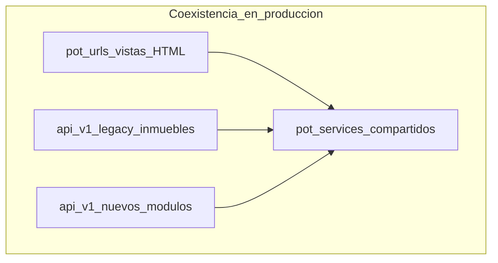
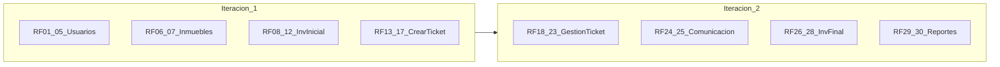

# Plan: Backend API — EDT + HU/RF + Actas de reunión

## Objetivo

Implementar `/api/v1/` cubriendo:

- **EDT del proyecto** (2 iteraciones, 6+7 módulos)
- **Historias de usuario** HU-01 a HU-09 y **RF-01 a RF-30** (documento de ingeniería)
- **Reglas de negocio** de Acta 1 (levantamiento) y Acta 2 (validación mockups + compromisos)

Dominio canónico: [`pot/models.py`](pot/models.py). Capa REST: `api/v1/`. Referencia: [`docs/API_PLAN.md`](docs/API_PLAN.md).

---

## Principio rector: reutilizar lo existente (no eliminar ni reemplazar)

La implementación es **aditiva**: se agrega `api/v1/` para el frontend nuevo; **no** se borra ni se sustituye lo que ya funciona.



### Qué ya está hecho y debe conservarse

| Componente | Ubicación | Política en el plan |
|------------|-----------|---------------------|
| App POT (login, dashboards, CRUD HTML) | [`pot/urls.py`](pot/urls.py), [`pot/views.py`](pot/views.py), `templates/` | **Mantener** rutas en `/` (login, properties, inventories, users). La API nueva **no** mueve ni desactiva estas vistas. |
| Servicios de negocio | [`pot/services/`](pot/services/) | **Reutilizar** desde los ViewSets/APIViews de `api/v1/` (misma lógica que las vistas HTML). |
| Modelos POT | [`pot/models.py`](pot/models.py) | **Extender** con migraciones; no duplicar dominio en `api.models`. |
| API catálogo público (`Inmueble`, galería, precio) | [`api/models.py`](api/models.py), [`api/views.py`](api/views.py) | **Conservar**; mover solo prefijo a `/api/v1/legacy/inmuebles/` sin quitar funcionalidad. |
| JWT + usuarios superuser | [`core/urls.py`](core/urls.py), [`api/views.py`](api/views.py) | **Mantener**; ampliar serializers/auth, no reescribir desde cero. |
| Emails transaccionales | [`pot/services/email_service.py`](pot/services/email_service.py), `templates/email/` | **Reutilizar** en notificaciones RF. |
| PDF inventario | [`generar_pdf_inventario`](pot/services/inventory_service.py) | **Reutilizar** en `GET /inventories/{id}/pdf/`. |
| Firmas inventario | [`completar_flujo_firma`](pot/services/signature_service.py) | **Reutilizar** en `POST /inventories/{id}/sign/`. |
| Historial inmueble | [`property_service`](pot/services/property_service.py) | **Reutilizar** en `GET /properties/{id}/history/`. |
| Auth (bloqueo intentos, reset) | [`auth_service`](pot/services/auth_service.py) | **Reutilizar** en `POST /auth/login/` y reset. |
| Middleware primer cambio de contraseña | [`pot/middleware.py`](pot/middleware.py) | **Mantener**; ya excluye `/api/` — no romper. |
| Storage R2 / media | [`core/settings.py`](core/settings.py) | **Mantener** configuración actual. |
| Django Admin | `admin/` | **Mantener**. |
| Scripts operativos | `create_first_superuser.py`, `setup_roles.py` | **Mantener** compatibles con modelos extendidos. |

### Calculadora y módulos del mockup sin API nueva aún

- **Calculadora** (sidebar mockups admin): en este repo **no hay** módulo backend de calculadora implementado. Si existe en el **frontend** (`casasysoluciones-frontend`) o en otra ruta del sitio público, el plan **no** la elimina ni la sustituye.
- Al implementar la API: **no** crear un “reemplazo” de calculadora salvo requerimiento explícito futuro.
- Si más adelante se expone por API: será un endpoint **opcional** (`/api/v1/calculator/`) sin tocar `api.Inmueble` ni POT.

### Dos dominios de “inmueble” (coexisten)

| Modelo | Uso | API |
|--------|-----|-----|
| `api.Inmueble` | Catálogo/listados públicos (precio, galería, Maps) | `/api/v1/legacy/inmuebles/` |
| `pot.Property` | Administración arriendos (POT + mockups gestión) | `/api/v1/properties/` |

**No unificar** en iteración 1 ni 2 salvo decisión explícita del cliente; solo documentar la diferencia.

### Mapeo: vista HTML existente → servicio → endpoint nuevo

| Flujo ya en POT | Servicio existente | Endpoint API (nuevo) |
|-----------------|-------------------|----------------------|
| Login / reset / primer password | `auth_service`, vistas auth | `/api/v1/auth/*` |
| Crear usuario arrendatario | `email_service`, `UserCreateView` | `POST /users/`, `POST /tenants/` |
| CRUD inmueble POT | `property_service`, `Property*View` | `/api/v1/properties/*` |
| Inventario espacios/fotos/PDF | `inventory_service`, vistas inventory | `/api/v1/inventories/*` |
| Firma inventario | `signature_service`, `InventorySign*` | `POST /inventories/{id}/sign/` |
| Asociar/desasociar inquilino | `property_service`, `AssociatePropertyView` | `POST/DELETE /tenants/.../properties/` |

Las vistas HTML pueden seguir llamando a los mismos servicios; la API es una **segunda fachada** paralela.

### Reglas para el desarrollo (checklist)

1. Antes de crear lógica nueva, buscar en `pot/services/` y `pot/views.py`.
2. Extraer a servicio solo si la vista y la API lo necesitan; **no** mover código HTML a la API eliminando la vista.
3. Migraciones: solo campos nuevos/nullables; datos existentes intactos.
4. Tests nuevos en `api/tests/`; no borrar tests existentes de `api/` o `pot/` sin revisión.
5. `INSTALLED_APPS` y `urls`: **añadir** includes, no quitar `pot.urls` ni router legado hasta deprecación acordada.

---

## Matriz EDT ↔ HU ↔ RF ↔ Iteración

| Módulo EDT | HU | RF (doc ingeniería) | Iteración |
|------------|-----|---------------------|-----------|
| Gestión de usuarios | HU-01 | RF-01 a RF-05 | 1 |
| Gestión de inmuebles | HU-02 | RF-06, RF-07 | 1 |
| Inventario inicial | HU-03, HU-04 (aceptación) | RF-08, RF-09, RF-10, RF-11, RF-12 | 1 |
| Creación de tickets | HU-05 | RF-13 a RF-17 | 1 |
| Pruebas / Despliegue parcial | — | CP-RF-01 a CP-RF-17 | 1 |
| Gestión de tickets | HU-06 | RF-18 a RF-21 | 2 |
| Seguimiento y estados | HU-06 | RF-22, RF-23 | 2 |
| Comunicación | HU-08 | RF-24, RF-25 | 2 |
| Inventario final | HU-07 | RF-26, RF-27, RF-28 | 2 |
| Reportes | HU-09 | RF-29, RF-30 | 2 |
| Pruebas / Despliegue final | — | CP-RF-18 a CP-RF-30 | 2 |



---

## Reglas de negocio (actas + RF) — impacto backend

| Regla | Fuente | Implementación API |
|-------|--------|-------------------|
| Canal único de daños: solo aplicación | Acta 1 | No hay endpoint alternativo; validar que solo `POST /tickets/mine/` crea solicitudes oficiales |
| Historial principal **por inmueble**, no por persona | Acta 1 | `GET /properties/{id}/history/` agrega tickets cerrados + inventarios + arrendatarios |
| Arrendatario con **varios inmuebles** | Acta 1 / RF-04 | Selector en `POST /tickets/mine/`; `GET /auth/me/` devuelve `properties[]` |
| Login con **cédula** + contraseña (inicial puede ser genérica) | Acta 1 / Acta 2 | `POST /auth/login/` acepta `email` **o** `document_number`; RF-01: bloqueo 5 intentos / 15 min (ya en `CustomUser`) |
| Solo **ADMIN** crea usuarios y cambia roles | Acta 1 / RF-02, RF-03 | Permiso `IsAdmin` en `POST /users/`, `PATCH .../role/` |
| **ASSISTANT** opera tickets e inventarios, **sin** reportes admin completos | Acta 1 / Compromisos Acta 2 | `IsAdmin` en `/reports/*`; assistant en properties, inventories, tickets |
| Desactivar arrendatario al fin de contrato **sin borrar historial** | RF-05 / Acta 1 | `POST /users/{id}/deactivate/`; desvincular inmueble, no `DELETE` usuario |
| Inventario inicial: espacios **dinámicos** (agregar sala, baño extra) | Acta 2 / RF-09 | `POST/DELETE /inventories/{id}/spaces/`; plantillas por `Property.type` |
| Condición espacio: **Bueno / Regular / Malo** | RF-09 | Enum `GOOD`, `REGULAR`, `BAD` |
| Fotos JPG/PNG, máx **5 MB** por imagen | RF-10, RF-17 | Validación en upload |
| Máx **5 archivos** por ticket (arrendatario) | RF-17 | Validación en `attachments` |
| Inventario final solo lo inicia **staff** (no arrendatario) | Acta 1 | `POST /inventories/` con `type=FINAL` → `IsStaffOperative` |
| Comparación inicial vs final + **paz y salvo** PDF | RF-27, RF-28 | `GET .../comparison/`, `GET .../closure-document/` |
| Estados ticket: **Abierto → Aceptado/Rechazado → En proceso → Cerrado** | RF-18 | Máquina de estados en `ticket_service` |
| Rechazo con **motivo obligatorio** (mín. 20 caracteres) | RF-19 | `POST /tickets/{id}/reject/` body `{reason}` |
| Maestro es **subcontratado** (sin cuenta en sistema) | Acta 1 | Campo `assigned_contractor_name` (texto), no FK a User |
| Evidencia reparación la sube **staff**; inquilino **confirma** | RF-21, RF-22 | `POST /tickets/{id}/repair-evidence/` (staff), `POST .../confirm/` (tenant) |
| **Cierre automático** si no responde en **1 día hábil** | Acta 1 / RF-23 | Job `close_expired_tickets`; campo `confirmation_deadline_at` |
| Mensajería **dentro del ticket** (sustituye WhatsApp para daños) | RF-24, RF-25 | Comments + `POST .../request-info/` tipo `INFO_REQUEST` |
| Notificación **email al abrir** ticket; in-app en acciones clave | Acta 1 / Acta 2 | `email_service` en create; no spam por cada mensaje |
| Reportes: inmuebles arrendados con tickets abiertos, export **Excel** | Acta 2 / RF-30 | Endpoints reportes + `export/excel` |
| Contador **pendientes por resolver** (semáforo) | Compromisos Acta 2 / RF-29 | `GET /tickets/stats/` incluye `pending_resolution`, `traffic_light` |
| Carga inicial desde **Excel** del cliente | Compromisos Acta 2 | `POST /admin/import/excel/` (solo ADMIN) |
| Trazabilidad ediciones en documentos finales | Compromisos Acta 2 | `DocumentAudit` o `UserAudit` en generación PDF |

---

## Enums y catálogos (`GET /api/v1/catalogs/`)

**Roles:** `ADMIN`, `ASSISTANT`, `TENANT`

**Property.type:** `APARTMENT`, `HOUSE`, `LOCAL`, `WAREHOUSE` (RF-06)

**Property.status:** `AVAILABLE`, `RENTED`, `MAINTENANCE`

**Inventory.condition:** `GOOD`, `REGULAR`, `BAD`

**Ticket.damage_type:** `PLUMBING`, `ELECTRICITY`, `LOCKSMITH`, `STRUCTURE`, `PAINTING`, `CARPENTRY`, `OTHER` (RF-15; mapear “Hidráulico” → `PLUMBING`)

**Ticket.priority:** `LOW` (Leve), `MEDIUM` (Importante), `HIGH` (Urgente) — RF-16

**Ticket.status:** `DRAFT`, `OPEN`, `ACCEPTED`, `IN_PROGRESS`, `REJECTED`, `CLOSED` (RF-18)

**Transiciones permitidas (RF-18):**
- `OPEN` → `ACCEPTED` | `REJECTED`
- `ACCEPTED` → `IN_PROGRESS`
- `IN_PROGRESS` → `CLOSED` (requiere evidencia reparación — RF-21)
- Cualquier estado activo → `REJECTED` (con motivo — RF-19)
- Staff puede forzar cierre con justificación (Acta 1)

---

## Iteración 1 — Detalle por módulo

### Base transversal

- Infra `api/v1/`, paginación, filtros, errores tipados
- Auth **RF-01**: login email o cédula, refresh, logout, me, reset, first-change, `password_changed`
- **RF-03** permisos por rol; assistant sin crear usuarios ni reportes admin
- Migraciones: `CustomUser` (`public_code`, `document_type`, `document_number`, avatar), `Property` (city, building, unit, cover)
- [`docs/API_PLAN.md`](docs/API_PLAN.md) con matriz RF ↔ endpoint

### Módulo usuarios — HU-01 (RF-01 a RF-05)

| RF | Endpoint | Notas |
|----|----------|-------|
| RF-01 | `POST /auth/login/` | Credenciales email o `document_number`; error claro; bloqueo intentos |
| RF-02 | `POST /users/` | Solo ADMIN; crea TENANT; envía contraseña temporal por correo |
| RF-03 | `PATCH /users/{id}/role/` | Solo ADMIN; advertencia si tickets abiertos (RF-03 flujo alterno) |
| RF-04 | `POST /tenants/{id}/properties/` | Multi-inmueble; bloquear doble arrendatario activo por inmueble |
| RF-05 | `POST /users/{id}/deactivate/` | Sin delete; conservar historial; desvincular inmuebles |

Endpoints adicionales: `GET /users/stats/`, `GET /tenants/`, `DELETE /tenants/{id}/properties/{property_id}/`

### Módulo inmuebles — HU-02 (RF-06, RF-07)

| RF | Endpoint | Notas |
|----|----------|-------|
| RF-06 | `POST /properties/` | Dirección única; `code` autogenerado; tipo y estado inicial |
| RF-07 | `GET /properties/{id}/history/` | Cronológico: tickets, inventarios, asociaciones arrendatario |

`GET /properties/` con filtros; `GET /properties/stats/`; `PATCH /properties/{id}/`

### Módulo inventario inicial — HU-03 / HU-04 (RF-08 a RF-12)

| RF | Endpoint | Notas |
|----|----------|-------|
| RF-08 | `POST /inventories/` | `type=INITIAL`; estado `IN_PROGRESS`; requiere inmueble + arrendatario activo |
| RF-09 | `POST /inventories/{id}/spaces/` | Espacios dinámicos; `DELETE .../spaces/{space_id}/` |
| RF-09 | `GET /inventories/space-templates/?property_type=` | Plantilla sugerida (casa/apt/local/bodega) — Acta 2 |
| RF-10 | `POST /inventories/{id}/spaces/{space_id}/photos/` | JPG/PNG ≤5MB |
| RF-11 | `POST /inventories/{id}/sign/` | Arrendatario; validar revisión completa; flujo alterno: `POST .../observations/` |
| RF-12 | `GET /inventories/{id}/pdf/` | PDF con espacios y fotos; log de generación |

Wizard: `PATCH step/1/`, bulk `PUT step/2/spaces/`, `POST save-draft/`, `POST finalize/` → `PENDING_SIGNATURE`

`GET /inventories/mine/` — arrendatario ve inventario pendiente de firma

### Módulo creación de tickets — HU-05 (RF-13 a RF-17)

| RF | Endpoint | Notas |
|----|----------|-------|
| RF-13 | `POST /tickets/mine/` | Estado inicial `OPEN`; radicado `TK-xxxxx`; notificar admin+assistant |
| RF-14 | Campo `property_id` en create | Obligatorio si >1 inmueble; auto si solo uno |
| RF-15 | Campo `damage_type` | Catálogo; `OTHER` + `damage_type_other` texto |
| RF-16 | Campo `priority` | LOW/MEDIUM/HIGH obligatorio |
| RF-17 | `POST /tickets/mine/{id}/attachments/` | Máx 5 imágenes; validar formato/tamaño |

`POST /tickets/mine/draft/` — estado `DRAFT`; `GET /tickets/mine/`, `GET /tickets/mine/{id}/`

### Pruebas i1

Casos **CP-RF-01 a CP-RF-17** del documento de ingeniería en `api/tests/test_i1_*.py`

### Despliegue parcial i1

- OpenAPI schema módulos i1
- `POST /admin/import/excel/` — importar inmuebles/arrendatarios desde Excel cliente (compromiso Acta 2)
- Legacy `/api/v1/legacy/`
- [`docs/DEPLOY.md`](docs/DEPLOY.md) borrador

---

## Iteración 2 — Detalle por módulo

### Gestión de tickets — HU-06 (RF-18 a RF-21)

| RF | Endpoint | Notas |
|----|----------|-------|
| RF-18 | `POST /tickets/{id}/status/` | Transiciones validadas; registrar `TicketStatusLog` |
| RF-19 | `POST /tickets/{id}/reject/` | `{reason}` min 20 chars; notificar arrendatario |
| RF-20 | `POST /tickets/{id}/assign/` | `{contractor_name}` + opcional nota visita; → `IN_PROGRESS` |
| RF-21 | `POST /tickets/{id}/repair-evidence/` | Staff adjunta fotos “después”; habilita cierre/confirmación |

Admin: `GET /tickets/`, filtros estado/prioridad/tipo/fecha, `GET /tickets/export/`

**RF-29 (parcial):** `GET /tickets/stats/`:
```json
{
  "open": 0, "in_progress": 0, "urgent": 0,
  "pending_resolution": 0,
  "traffic_light": { "red": 0, "yellow": 0, "green": 0, "grey": 0 }
}
```
`pending_resolution` = abiertos + aceptados sin asignar + en proceso (compromiso Acta 2)

### Seguimiento y estados — HU-06 (RF-22, RF-23)

| RF | Endpoint | Notas |
|----|----------|-------|
| RF-22 | `POST /tickets/mine/{id}/confirm/` | Cierra ticket; registra confirmación |
| RF-22 alt | `POST /tickets/mine/{id}/dispute/` | Inconformidad → vuelve a `ACCEPTED` |
| RF-23 | Job `close_expired_tickets` | Si `confirmation_deadline_at` vencido sin respuesta → `CLOSED` automático |
| — | `GET /tickets/{id}/timeline/` | Historial estados + acciones |

Al adjuntar evidencia reparación: set `confirmation_deadline_at` = +1 día hábil; email recordatorio 24h antes (RF-23)

### Comunicación — HU-08 (RF-24, RF-25)

| RF | Endpoint | Notas |
|----|----------|-------|
| RF-24 | `GET/POST /tickets/{id}/comments/` | Hilo cronológico; bloqueado si `CLOSED` |
| RF-25 | `POST /tickets/{id}/request-info/` | Mensaje tipo `INFO_REQUEST`; notificación alta prioridad |
| — | `GET /notifications/`, `unread-count/`, `PATCH .../read/` | In-app; email solo en eventos definidos |

Modelo `TicketComment`: `message_type` = `NORMAL` | `INFO_REQUEST`

### Inventario final — HU-07 (RF-26 a RF-28)

| RF | Endpoint | Notas |
|----|----------|-------|
| RF-26 | `POST /inventories/` | `type=FINAL`; solo staff; precarga espacios desde INITIAL aceptado |
| RF-27 | `GET /inventories/{id}/comparison/` | Tabla inicial vs final; resaltar deterioro |
| RF-28 | `GET /inventories/{id}/closure-document/` | PDF paz y salvo: comparativo + resumen tickets del contrato |
| — | `POST /contracts/{id}/close/` | Marca fin contrato; desvincula inquilino; opcional desactivar si sin más inmuebles |

Modelo **`LeaseContract`**: `property`, `tenant`, `start_date`, `end_date`, `status`

Firmas en PDF final: representante inmobiliaria + arrendatario (y propietario si aplica — Acta 2)

`GET /dashboard/admin/`, `GET /dashboard/tenant/` — resumen operativo

### Reportes — HU-09 (RF-29, RF-30)

| RF | Endpoint | Notas |
|----|----------|-------|
| RF-29 | `GET /reports/ticket-traffic-light/` | Semáforo consolidado |
| RF-30 | `GET /reports/properties/{id}/repair-history/` | Historial reparaciones del inmueble |
| RF-30 | `GET /reports/properties-with-open-tickets/` | Inmuebles arrendados con tickets abiertos (Acta 2) |
| RF-30 | `GET /reports/tenants-with-active-tickets/` | Inquilinos con tickets activos |
| — | `GET /reports/summary/`, gráficos por estado/prioridad/tipo | Mockup reportes |
| — | `GET /reports/export/excel/` | Export con filtros `date_from`, `date_to`, `property_id` |
| — | `GET /search/?q=` | Búsqueda global |

**Permiso:** `GET /reports/*` → solo `ADMIN` (assistant excluido de reportes administrativos — compromiso Acta 2)

### Pruebas i2

Casos **CP-RF-18 a CP-RF-30** en `api/tests/test_i2_*.py`

### Despliegue final i2

- Management command o cron: `close_expired_tickets`
- Rate limiting login
- `UserAudit` / trazabilidad PDF
- Schema OpenAPI completo
- Variables entorno documentadas

---

## Modelos nuevos / extensiones (resumen)

**CustomUser:** `document_number` (unique), `document_type`, `public_code`, avatar

**Property:** city, building_name, unit_label, cover_image (ya tiene type/status/code)

**Ticket:** `public_code`, description, damage_type, damage_type_other, priority, status (6 valores), `assigned_contractor_name`, `rejection_reason`, `confirmation_deadline_at`, `closed_automatically`, `tenant_confirmed_at`

**Nuevos:** `TicketAttachment`, `TicketComment`, `TicketStatusLog`, `Notification`, `LeaseContract`, `InventorySpaceTemplate` (opcional), `DocumentGenerationLog`

**Inventory:** current_step, progress_percent, is_draft; espacios dinámicos ya en `InventorySpace`

---

## RBAC refinado (actas + RF)

| Acción | ADMIN | ASSISTANT | TENANT |
|--------|-------|-----------|--------|
| Crear/editar usuarios y roles | Sí | No | No |
| CRUD inmuebles | Sí | Sí | No |
| Inventario inicial/final | Sí | Sí | Ver/firmar propio |
| Crear ticket | No | No | Sí |
| Gestionar ticket (estados, asignar, rechazar) | Sí | Sí | No |
| Confirmar reparación | No | No | Sí |
| Chat en ticket | Sí | Sí | Sí |
| Reportes administrativos / export Excel | Sí | **No** | No |
| Import Excel inicial | Sí | No | No |
| Paz y salvo / cerrar contrato | Sí | Sí | No |

---

## Criterios de éxito (alineados a RF)

**Iteración 1:** CP-RF-01 a CP-RF-17 pasan; flujos RF-08→RF-12 y RF-13→RF-17 demostrables vía API.

**Iteración 2:** CP-RF-18 a CP-RF-30 pasan; semáforo y pendientes por resolver en stats; cierre automático verificable; paz y salvo PDF generado.

---

## Archivos principales

- [`pot/models.py`](pot/models.py), [`pot/services/`](pot/services/)
- `api/v1/`, [`core/urls.py`](core/urls.py), [`core/settings.py`](core/settings.py)
- [`docs/API_PLAN.md`](docs/API_PLAN.md), [`docs/DEPLOY.md`](docs/DEPLOY.md)
- `api/tests/test_i1_*.py`, `api/tests/test_i2_*.py`
- `pot/management/commands/close_expired_tickets.py` (i2)

## Fuera de alcance (nuevo desarrollo API)

- Cuentas de login para maestros subcontratados (solo nombre en ticket — Acta 1)
- **Nueva** calculadora o módulo de pagos en backend (si ya existe en front u otro servicio, **no tocarlo**)
- WebSockets (polling para mensajes en v1)

## No tocar / no reemplazar (explícito)

- Vistas y templates POT en [`pot/`](pot/)
- [`api.Inmueble`](api/models.py), [`api.Inquilino`](api/models.py), [`HistorialAlquiler`](api/models.py)
- Rutas raíz `path('', include('pot.urls'))` en [`core/urls.py`](core/urls.py)
- Funciones ya probadas en producción: PDF, firma, emails, códigos `PRO-xxxxx`
